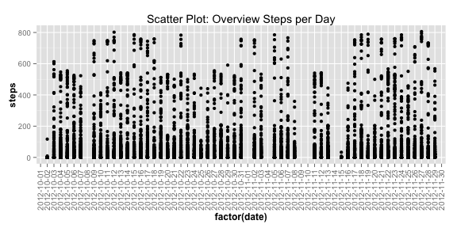
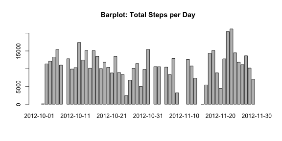
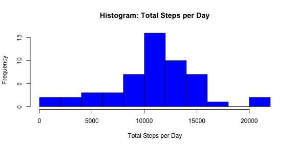
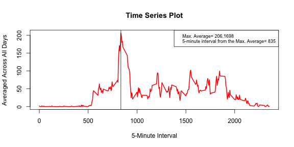
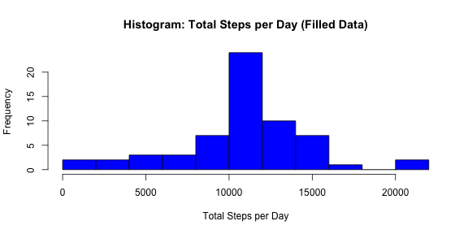
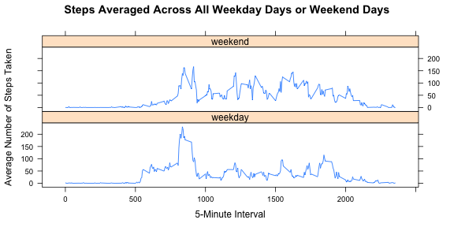
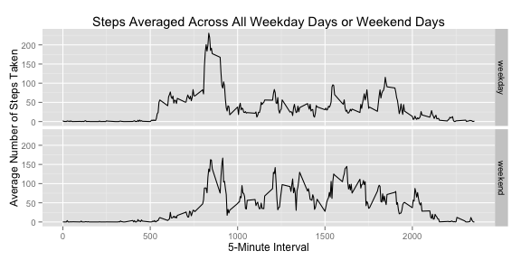

Reproducible Research - Peer Assessment 1
=========================================

This Markdown document performs a statistical analysis of data collected on human activities. The dataset is stored in a comma-separated-value (CSV) file and there are a total of 17,568 observations in this dataset. The variables included in this dataset are:

1. **steps**: Number of steps taking in a 5-minute interval (missing values are coded as *NA*);
2. **date**: The date on which the measurement was taken in YYYY-MM-DD format;
3. **interval**: Identifier for the 5-minute interval in which measurement was taken;

### Set Global Options, Libraries and Parameters

First I set some global parameters in order to my pieces of code (chunks in this R markdown document) become visible.


```r
library(knitr)
library(dplyr)
library(ggplot2)
library(lattice)
opts_chunk$set(echo = TRUE)
```


### Section 1: Loading and preprocessing the data

Initially I load the raw data and collect general information:


```r
raw_data <- read.csv("activity.csv", sep=",")
steps <- raw_data[,1]
date <- raw_data[,2]
interval <- raw_data[,3]
head(raw_data)
```

```
##   steps       date interval
## 1    NA 2012-10-01        0
## 2    NA 2012-10-01        5
## 3    NA 2012-10-01       10
## 4    NA 2012-10-01       15
## 5    NA 2012-10-01       20
## 6    NA 2012-10-01       25
```

The raw data has 17568 rows and 3 columns. We can have a first global view of the data:


```r
ggplot(data=raw_data, aes(x=factor(date), y=steps)) +
        labs(title = "Scatter Plot: Overview Steps per Day") + geom_point() + 
        theme(axis.title.x = element_text(face="bold",  size=12),
              axis.text.x  = element_text(angle=90, vjust=0.5, size=10),
              axis.title.y = element_text(face="bold", size=12))
```

 

### Section 2: What is mean total number of steps taken per day?

First I make a Bar Plot to have a alternative Overview of the Data. Then I make the histogram of the total number of steps taken each day.


```r
group <- group_by(raw_data, date)
summed <- summarise(group, TotSteps = sum(steps))
barplot(height=summed$TotSteps, names.arg=summed$date, main="Barplot: Total Steps per Day")
```

 

```r
hist(summed$TotSteps, breaks = 10, col="blue", main="Histogram: Total Steps per Day", xlab="Total Steps per Day")
```

 

As an alternative information I print a detailed report of the total steps per day. Then I calculate and report the mean and median total number of steps taken per day:


```r
na_index <- is.na(steps)
raw_data_without_na <- raw_data[!na_index,]
date_group_without_na <- group_by(raw_data_without_na, date)
summed1_without_na <- summarise(date_group_without_na, Tot_Steps = sum(steps))
summed1_without_na
```

```
## Source: local data frame [53 x 2]
## 
##          date Tot_Steps
## 1  2012-10-02       126
## 2  2012-10-03     11352
## 3  2012-10-04     12116
## 4  2012-10-05     13294
## 5  2012-10-06     15420
## 6  2012-10-07     11015
## 7  2012-10-09     12811
## 8  2012-10-10      9900
## 9  2012-10-11     10304
## 10 2012-10-12     17382
## 11 2012-10-13     12426
## 12 2012-10-14     15098
## 13 2012-10-15     10139
## 14 2012-10-16     15084
## 15 2012-10-17     13452
## 16 2012-10-18     10056
## 17 2012-10-19     11829
## 18 2012-10-20     10395
## 19 2012-10-21      8821
## 20 2012-10-22     13460
## 21 2012-10-23      8918
## 22 2012-10-24      8355
## 23 2012-10-25      2492
## 24 2012-10-26      6778
## 25 2012-10-27     10119
## 26 2012-10-28     11458
## 27 2012-10-29      5018
## 28 2012-10-30      9819
## 29 2012-10-31     15414
## 30 2012-11-02     10600
## 31 2012-11-03     10571
## 32 2012-11-05     10439
## 33 2012-11-06      8334
## 34 2012-11-07     12883
## 35 2012-11-08      3219
## 36 2012-11-11     12608
## 37 2012-11-12     10765
## 38 2012-11-13      7336
## 39 2012-11-15        41
## 40 2012-11-16      5441
## 41 2012-11-17     14339
## 42 2012-11-18     15110
## 43 2012-11-19      8841
## 44 2012-11-20      4472
## 45 2012-11-21     12787
## 46 2012-11-22     20427
## 47 2012-11-23     21194
## 48 2012-11-24     14478
## 49 2012-11-25     11834
## 50 2012-11-26     11162
## 51 2012-11-27     13646
## 52 2012-11-28     10183
## 53 2012-11-29      7047
```

```r
df1 <- data.frame(Total_Global_Steps=sum(summed1_without_na$Tot_Steps),
                  Mean_Steps=mean(summed1_without_na$Tot_Steps),
                  Median_Steps=median(summed1_without_na$Tot_Steps))
df1
```

```
##   Total_Global_Steps Mean_Steps Median_Steps
## 1             570608   10766.19        10765
```


### Section 3: What is the average daily activity pattern?

Make a time series plot (i.e. type = "l") of the 5-minute interval (x-axis) and the average number of steps taken, averaged across all days (y-axis). Which 5-minute interval, on average across all the days in the dataset, contains the maximum number of steps?


```r
interval_group_without_na <- group_by(raw_data_without_na, interval)
summed2_without_na <- summarise(interval_group_without_na, Mean_Steps = mean(steps))
max_average <- max(summed2_without_na$Mean_Steps)
plot(summed2_without_na$interval, summed2_without_na$Mean_Steps, type="l",
     xlab="5-Minute Interval", ylab="Averaged Across All Days",
     main="Time Series Plot",col="RED", lwd=2)
position_max <- summed2_without_na$interval[which(summed2_without_na$Mean_Steps==max_average)]
abline(v=position_max, col="BLACK")
LEGEND_INFO <- c(paste("Max. Average=", signif(max_average, digits = 7)), paste("5-minute interval from the Max. Average=", position_max))
legend("topright", legend = LEGEND_INFO, cex=0.75)
```

 


### Section 4: Imputing missing values

1. Calculate and report the total number of missing values in the dataset (i.e. the total number of rows with NAs)

At the beginning of this Markdown we collect the columns **steps**, **date** and **interval**. From the original dataset we find  missing values in the **steps** column. So we can calculate the total amount of missing values:


```r
sum(is.na(steps))
```

```
## [1] 2304
```

2. Devise a strategy for filling in all of the missing values in the dataset.   

**My strategy**: if we fill the missing values with zeros, for example, there will be a strong shift of the global average of steps. In this case, my strategy will be simply to fill the missing values with the mean of the steps per 5-Minute-Interval. Below we list what are the dates with missing values and how many 5-Minute-Intervals has missing values and how many have not:


```r
# Collect the index of the missing values
index_na <- (1:length(steps))[is.na(steps)]
dates_na <- unique(date[index_na])

# Which dates the missing values correspond
df2 <- data.frame(Dates_NA = dates_na,
                  Total_NA = rep(0, length(dates_na)),
                  Total_NOT_NA = rep(0, length(dates_na)))

for(i in (1:length(dates_na)))
        {
        date_aux <- dates_na[i]
        indices_day <- which(date == date_aux)
        steps_of_the_day <- steps[indices_day]
        df2$Total_NA[i] <- sum(is.na(steps_of_the_day))
        df2$Total_NOT_NA[i] <- sum(!is.na(steps_of_the_day))
        }
df2
```

```
##     Dates_NA Total_NA Total_NOT_NA
## 1 2012-10-01      288            0
## 2 2012-10-08      288            0
## 3 2012-11-01      288            0
## 4 2012-11-04      288            0
## 5 2012-11-09      288            0
## 6 2012-11-10      288            0
## 7 2012-11-14      288            0
## 8 2012-11-30      288            0
```

3. Create a new dataset that is equal to the original dataset but with the missing data filled in.


```r
data_filled <- raw_data
for(i in (1:length(dates_na)))
        {
        date_aux <- dates_na[i]
        indices_day <- which(date == date_aux)
        data_filled[indices_day, 1] <- summed2_without_na$Mean_Steps
        }
```


4. Make a histogram of the total number of steps taken each day and Calculate and report the mean and median total number of steps taken per day. Do these values differ from the estimates from the first part of the assignment? What is the impact of imputing missing data on the estimates of the total daily number of steps?

I make a histogram of the total number of steps taken each day.


```r
group2 <- group_by(data_filled, date)
summed2 <- summarise(group2, TotSteps = sum(steps))
#barplot(height=summed2$TotSteps, names.arg=summed2$date, main="Barplot: Total Steps per Day (Filled Data)")
hist(summed2$TotSteps, breaks = 10,col="blue", main="Histogram: Total Steps per Day (Filled Data)", xlab="Total Steps per Day")
```

 

I calculate and report the mean and median total number of steps taken per day. So we can see the impact of imputing missing data on the estimates of the total daily number of steps. The data frame below shows a comparison of the past result (with missing values) and the new result with missing data filled with the average of the steps per 5-Minute-Interval.


```r
date_group_filled <- group_by(data_filled, date)
summed_filled <- summarise(date_group_filled, Tot_Steps = sum(steps))
df3 <- data.frame(Type_Data = c("With Missing Value", "Without Missing Value"),
                  Total_Global_Steps = c(df1$Total_Global_Steps, sum(summed_filled$Tot_Steps)),
                  Mean_Steps = c(df1$Mean_Steps, mean(summed_filled$Tot_Steps)),
                  Median_Steps = c(df1$Median_Steps, median(summed_filled$Tot_Steps)))
df3
```

```
##               Type_Data Total_Global_Steps Mean_Steps Median_Steps
## 1    With Missing Value           570608.0   10766.19     10765.00
## 2 Without Missing Value           656737.5   10766.19     10766.19
```


### Section 5: Are there differences in activity patterns between weekdays and weekends?

For this part the weekdays() function may be of some help here. I use the dataset with the filled-in missing values for this part.

1. Create a new factor variable in the dataset with two levels – "weekday" and "weekend" indicating whether a given date is a weekday or weekend day.


```r
days <- weekdays(as.Date(date))
factor_day <- rep("", length(days))
for(i in (1:length(days)))
        {
        factor_day[i] <- ifelse((days[i]=="Saturday") || (days[i]=="Sunday"), "weekend", "weekday")
        }
data_filled$day_type <- factor_day
```


2. Make a panel plot containing a time series plot (i.e. type = "l") of the 5-minute interval (x-axis) and the average number of steps taken, averaged across all weekday days or weekend days (y-axis). I have used two plotting system in R (lattice and ggplot) only to compare the graphic design of each one.


```r
summed3_weekday <- data_filled %>% group_by(interval, day_type) %>% summarise(Mean_Steps = mean(steps))
head(summed3_weekday)
```

```
## Source: local data frame [6 x 3]
## Groups: interval
## 
##   interval day_type Mean_Steps
## 1        0  weekday 2.25115304
## 2        0  weekend 0.21462264
## 3        5  weekday 0.44528302
## 4        5  weekend 0.04245283
## 5       10  weekday 0.17316562
## 6       10  weekend 0.01650943
```

```r
xyplot(summed3_weekday$Mean_Steps ~ summed3_weekday$interval | summed3_weekday$day_type, main="Steps Averaged Across All Weekday Days or Weekend Days",xlab="5-Minute Interval", ylab="Average Number of Steps Taken",layout=c(1,2), type="l")
```

 

```r
ggplot(summed3_weekday, aes(interval, Mean_Steps)) + 
        facet_grid(day_type ~ .) + 
        geom_line() + 
        labs(x = "5-Minute Interval", y = "Average Number of Steps Taken") + 
        labs(title = "Steps Averaged Across All Weekday Days or Weekend Days") 
```

 


